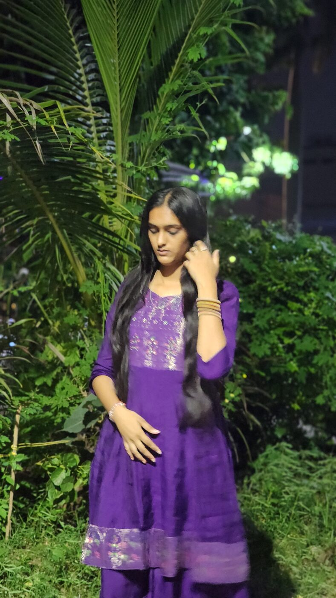

# Purava's Birthday Issue — Setup Guide

## 1. Add your photos
Create an `images` folder next to `index.html` and drop your photos in with these exact names:

- `cover.jpg` — the main cover photo
- `photo1.jpg` through `photo6.jpg` — the feature gallery

Then in `index.html`, find each `<div class="placeholder">...</div>` and replace it with:

```html

```

(swap `cover.jpg` for the right filename each time)

## 2. Personalize the text
Search for these spots and edit them directly in `index.html`:
- The editor's letter (the long paragraph after the drop-cap "D")
- "By The Numbers" — her age, and any fun stats you want
- "The Details" — known for / best feature / currently into
- "Letters To The Editor" — 2–3 short messages from family/friends
- The finale message near the bottom

## 3. Deploy to Vercel (free, ~2 minutes)
**Easiest way — no coding needed:**
1. Go to https://vercel.com and sign up (free) with GitHub, Google, or email.
2. Click **Add New → Project → Deploy without Git** (or drag-and-drop option on the dashboard).
3. Drag your whole `purava-site` folder (with `index.html` and the `images` folder inside) into the upload area.
4. Click **Deploy**. Vercel gives you a live link like `purava-birthday.vercel.app` in under a minute.

**If you prefer the CLI:**
```bash
npm i -g vercel
cd purava-site
vercel
```
Follow the prompts (press Enter to accept defaults) — it'll give you a live URL.

You can also set a custom domain or rename the project from your Vercel dashboard afterward.
